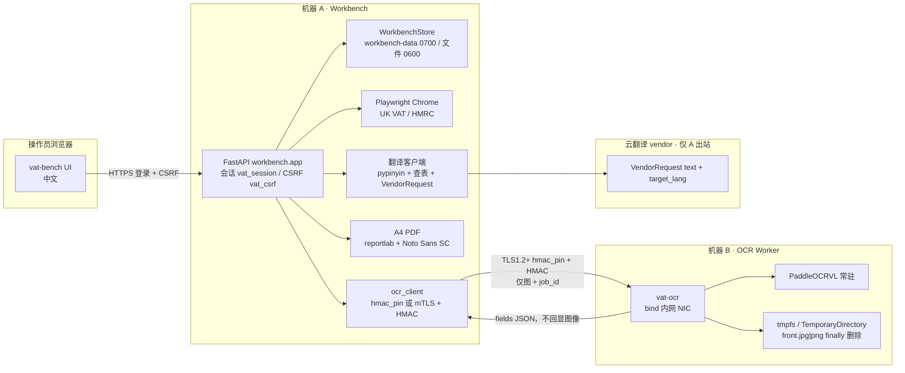
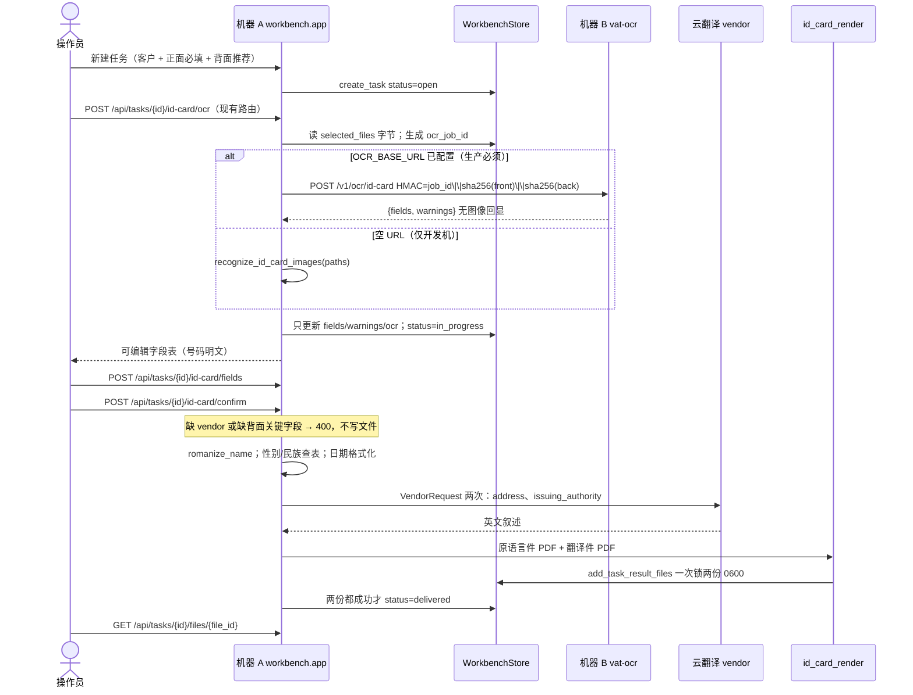
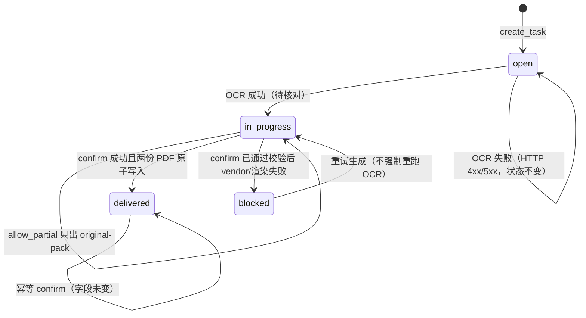

# 销售交付工作台：身份证翻译件双机架构设计

| 字段 | 值 |
| --- | --- |
| 文档标题 | 翻译证件照：Workbench / OCR Worker 拆分与交付件生成 |
| 作者 | 工作台架构 |
| 日期 | 2026-08-21 |
| 状态 | Draft |
| 产品 | vat-bench（内部销售/交付工作台） |
| 范围 | 插件 `translate-id`（翻译证件照）；营业执照 / POA 不在本设计实现范围内 |
| 代码根 | `/Users/shao/ClaudeCode/UK-VAT-signup-flow-img` |

---

## Overview

vat-bench 是内部销售与交付共用的 FastAPI 工作台（入口 `vat-bench` → `workbench.app:main`）。菜单由插件登记（`workbench/catalog.py`），英国 VAT 的 Playwright Chrome 跑在工作台所在机器上。当前「翻译证件照」插件（`translate-id`）已能建任务、勾选照片，并通过 `POST /api/tasks/{id}/id-card/ocr` **在工作台进程内**加载 PaddleOCRVL 抽字段；译文仍靠人工 `POST /api/tasks/{id}/translate/{kind}` 回传。PaddleOCR-VL（约 0.9B）与本机 Chrome 争 CPU/RAM/GPU，单机无法稳定并存。

本设计把系统拆成两台机器：

- **机器 A（Workbench）**：门户、会话/CSRF、客户与任务库、字段核对 UI、云翻译 API **客户端**、原语言件与身份证翻译件 PDF 生成、英国 VAT Chrome。翻译能力是 vendor API 的客户端，**不是第三台服务器**。
- **机器 B（OCR Worker）**：只跑 PaddleOCRVL。收图片、回结构化字段。无登录、无客户库、无云翻译、无任何出站到 HMRC。不启动 Chrome。B 可以安装同一个 `uk-vat-automation` 包（因而磁盘上可能有 Playwright 依赖），但 `workbench.ocr_service` **不得** import `workbench.app` / `workbench.store` / `vat_automation.runner`，并由 import-graph 测试锁死。

操作员上传中国居民身份证 **正面（必填）与背面（生成完整交付件时必填）** 照片后，系统产出两类可下载物。它们是对中华人民共和国居民身份证的译文整理，**不是**任何政府签发的证件，也不是原件的核证副本：

1. **原语言件**（`kind=original-pack`）：A4 PDF；中文 8 字段表 + 原图。
2. **身份证翻译件**（`kind=id-translation`）：A4 PDF；同一 8 行的中英对照表。身份证号必须出现在 **两份** PDF 中。

A↔B 载荷只含图像字节、一次性 `ocr_job_id` 和正反面 part。传输底线是 **TLS 1.2+ + 应用层 HMAC**。两节点局域网或 WireGuard 上的 **生产默认** 是 `OCR_AUTH_MODE=hmac_pin`（HTTPS + 服务端叶证书 DER 的 SHA-256 指纹钉扎 + HMAC）。mTLS 是加固目标，不是两周硬截止。HMAC **不**签原始 multipart 字节，而签 `METHOD || PATH || job_id || sha256(front) || sha256(back)`（缺 `front`/`back` 时该摘要为 **64 个 `0`**，即 `EMPTY_DIGEST = "0" * 64`，不是空串，也不是 `sha256(b"")`）。

---

## Background & Motivation

### 当前实现

| 能力 | 位置 | 行为 |
| --- | --- | --- |
| 工作台 HTTP | `workbench/app.py` | FastAPI；默认 `--host 127.0.0.1 --port 8770`；LAN 时走 `vat_automation.tls.ensure_certificate` |
| 会话 | `vat_automation.web` 常量 + `SessionSigner` | Cookie `vat_session`（HttpOnly, SameSite=strict, Secure iff TLS）。Cookie **没有** `Max-Age` / `Expires`，随浏览器进程；**令牌内部** TTL 为 `SESSION_TTL_SECONDS = 8 * 3600`。签名密钥进程内随机，重启后全部失效 |
| CSRF | `require_csrf` | Cookie `vat_csrf`（非 HttpOnly）与头 `x-csrf-token` 做 `hmac.compare_digest`，外加 Same-Origin |
| 客户/任务存储 | `workbench/store.py` `WorkbenchStore` | 根目录 `workbench-data/` `0700`；JSON 经 `_write_private` 以 `os.open(..., 0o600)` 写入；图片/PDF 现为 `write_bytes` 再 `chmod 0o600`（有 umask 窗口，本设计在原子写 PDF 时一并改成 `os.open`）；单文件 ≤ 25MB |
| 插件登记 | `workbench/plugins/translate.py` | `translate-id` / `translate-license` / `translate-poa`，`task_kind="translate"` |
| 证件 OCR 路由 | `ocr_id_card_task`（`workbench/app.py` 约 L585–618） | 读 `task.selected_files` 中后缀属于 `ID_CARD_IMAGE_SUFFIXES` 的本地路径，调用 `recognize_id_card_images`。失败时 HTTP 400/503，**不**改 `task.status` |
| 本地推理 | `workbench/id_card_ocr.py` | 进程内单例 `PaddleOCRVL()`（无 `save_path`）+ `threading.Lock`；`predict(str(image))` 后只在内存抽字段，现网已不落盘 |
| 字段抽取 | `workbench/id_card.py` | `extract_id_card_fields` / `merge_id_card_fields`；键与 UI `ID_CARD_LABELS` 对齐 |
| 识别结果落库 | `store.update_task(..., extracted_id_card={"fields": fields})` | **整对象替换**；状态 `in_progress`，文案「已识别证件字段，待核对」 |
| 前端 | `workbench/static/index.html` | `#id-card-ocr` / `#id-card-fields`；输入框可改但 **没有写回 API**。`renderJob()` 在 `plugin_id==translate-id` 时 **同时**显示 `#id-card-box` 与 `#translate-box`（因为 `task_kind==="translate"`） |
| 译文 | `upload_translation` | 对所有 `task_kind=translate` 开放；`kind=translation` 时 `status=delivered` |
| paddleocr | `pyproject.toml` optional extra `ocr` | **不得**改成必装依赖 |
| 参考推理 | `/Users/shao/ClaudeCode/IDcard_businessCertificate_translateion/demo.py` | `PaddleOCRVL().predict(path)`；demo 调用 `save_to_json` 与 `save_to_markdown`（**没有** `save_to_img`）。生产 worker **禁止**调用这三者 |

插件 intake 现状（`translate-id`）：

```python
intake={
    "files": [
        {"category": "translation-source", "label": "证件照片", "min": 1},
    ]
}
```

即：至少 1 张图即可建任务；正反面未区分；OCR 把所有图片 merge 成一套字段。向导 `renderCustomerDetail()` 对 intake 里出现的 category **全部自动勾选**；`step2Ready()` 只检查 `min`、不检查 `max`。

### 痛点

1. **资源争用（高）**：PaddleOCR-VL 冷启动与首次 `predict` 可达数十秒，常驻约 2–4GB；Playwright Chrome 另占 0.5–1.5GB 且持有 HMRC 会话。同一进程/同一台 16GB 机器上两者同时运行会抖动、OOM、拖垮 VAT 填表。
2. **交付物不对**：产品要的是「原语言件 + 身份证翻译件」，不是操作员手工回传任意 PDF。UI 仍写「上传原件后，再回传译文即标记已交付」，且 `translate-id` 上识别盒与回传盒并存。
3. **核对无法保存**：`renderIdCardFields` 生成 `<input data-id-field>`，刷新后从 `extracted_id_card.fields` 重绘，编辑丢失。
4. **PII 面过大**：若继续在 A 上跑 OCR，demo 式 `save_to_json` / `save_to_markdown` 会把证件图和识别文本写到磁盘；若把整份客户 JSON 发给 B，B 被盗即全量泄露。
5. **后缀不一致**：`WorkbenchStore.add_customer_file` 允许 `.jpg/.jpeg/.png/.gif/.bmp/.pdf/...`，OCR 还认 `.webp/.tif/.tiff`，后者根本存不进去。

### 为何允许且应当拆机

用户已选定 A/B 拆分。OCR 是重模型、无状态、无业务身份；工作台是有登录、有 Chrome、有客户库的门户。把 OCR 挪到 B，A 继续当翻译 **客户端**，满足「不要第三台翻译服务器」的约束。同机 cgroup 限制 VL 只能缓解争用，不能去掉「模型与 Chrome 抢 RAM」；仅当 RAM 仍不够才拆机的路径已被用户否决，本设计直接按双机交付。

---

## Goals & Non-Goals

### Goals

- 操作员在 vat-bench 为客户创建 `translate-id` 任务：挂身份证正面（必填）与背面（完整交付必填）。
- 工作台对 UI **保持** `POST /api/tasks/{id}/id-card/ocr`；内部在配置了 `OCR_BASE_URL` 时调用 B。空 `OCR_BASE_URL` **仅开发机**（可走本地 `recognize_id_card_images`）。生产必须指向 B。
- B 只暴露内网 OCR HTTP：收图、回 8 个结构化字段 + warnings。
- A↔B：私网或 WireGuard；TLS 1.2+；生产默认 `hmac_pin`；HMAC 覆盖 `METHOD || PATH || job_id || sha256(front) || sha256(back)`（缺图为 64 个 `0`）；载荷最小化。
- 人工核对并确认后，A 本地完成姓名拼音、性别/民族表、日期格式化；vendor 请求冻结为 `VendorRequest = {text, target_lang}`，一次一个叙述字段；身份证号 **永不**发给 vendor。
- 一次 store 锁内原子写入两份 PDF（每文件 `os.open` 0600），**两份都成功**才 `status=delivered`。
- 持久任务状态只有 `open | in_progress | blocked | delivered`，不引入与 VAT「核对中」碰撞的 `reviewing`。
- 审计日志记录 `ocr_job_id`、字节数、耗时，不记录图像字节、不记录完整身份证号。任务 **列表** 掩码号码；核对 **表单** 明文。
- 新业务仍是插件登记；不改首页菜单结构。UI 文案中文。

### Non-Goals

- 不实现营业执照翻译、POA 翻译的自动 OCR/渲染（插件继续占位/手工回传）。
- 不把 paddleocr 写入 `pyproject.toml` 的必装 `dependencies`。
- 不在 B 上 **运行** 登录、客户库、云翻译、HMRC、Chrome（安装面上 Playwright 可能随同包出现，见 Key Decision 11）。
- 不生成、不模仿外国政府身份证版式（无 UK/US 证件模板、无国徽仿制、无 MRZ）。
- 不在本设计中选定具体云翻译供应商（见 Open Questions）。未配置 vendor 时 confirm **不得** `delivered`。
- 不替换英国 VAT 自动化；Chrome 仍只在 A 上跑。
- 不引入独立「翻译微服务」。
- 不把证件图同步到对象存储或公有云。
- 首期不把 OCR worker 拆成无 Playwright 的独立发行版。

---

## Key Decisions

1. **A/B 物理拆分，翻译留在 A 做 vendor 客户端。**  
   理由：OCR 与 Chrome 争资源；翻译需要客户任务上下文和模板，且必须在确认之后才调用 vendor。第三台翻译机只增加密钥与网络面，没有隔离收益。

2. **两节点 LAN/WireGuard 的生产默认是 `hmac_pin`；mTLS 是加固目标，不是时限。钉扎只发生在 A 的 TLS 客户端；B 用与工作台相同的 `uvicorn.run(ssl_certfile=, ssl_keyfile=)`，不传预构建 `SSLContext`。**  
   理由：TLS 提供机密性，叶证书 DER SHA-256 钉扎防 MITM，HMAC 提供请求身份与完整性。现网 `workbench/app.py` `main()` 已是 `ssl_certfile`/`ssl_keyfile`；本仓库锁定 uvicorn `>=0.30,<1`（`uv.lock` 为 0.52.3），`uvicorn.run()` **没有** `ssl=ctx` 参数。Open Question 8 保留为「是否/何时上 mTLS」，**没有**两周硬截止。

3. **HMAC 签 `METHOD || PATH || job_id || sha256(front) || sha256(back)`（另含 timestamp/nonce），否决 raw multipart body hash。**  
   理由：httpx 默认流式生成 multipart，boundary 在发送时才确定；Starlette 解析 `UploadFile` 会消费 body。分 part 摘要与传输编码解耦。canonical 必须含 method/path，否则 OCR 的签名可搬到 `/healthz/detail`。缺图时摘要为 64 个 `0`，六个 HMAC 头一律发送。

4. **B 的请求体只有图像字节 + 一次性 `ocr_job_id` + `front`/`back` part。**  
   理由：B 被盗或被窃听时，攻击者拿不到客户名、账号、任务标题、项目编号。`ocr_job_id` 用 `secrets.token_hex(16)`，**不等于** `task_id` / `customer_id`。未知 multipart part → 400。

5. **VendorRequest 冻结为 `{text, target_lang}`；出网前 NFKC + 去掉空白/短横线 + 拒绝 15–18 位连续数字。**  
   理由：号码/姓名/性别/民族/出生/有效期限不出网。禁止 prompt 出现 “ID card / 身份证 / 客户名”。裸 `\d{17}[\dXx]` 会被空格、短横、全角数字绕过。翻译客户端 logger 只打 `len(text)` 与 HTTP 状态，不打正文。

6. **正面建任务即可 OCR；缺背面不得 `delivered`。**  
   理由：兼容现网 `min: 1`。`allow_partial=true` 只允许出 `original-pack`、禁止翻译件，状态保持 `in_progress`。intake `min` 是否改为 1 仍开放（切换成本低）。

7. **保留 `POST /api/tasks/{id}/id-card/ocr` 给 UI；空 `OCR_BASE_URL` 仅开发机。**  
   理由：现有 `index.html` 与 `tests/test_id_card.py` 已绑定该路由。生产回滚 = 保留 `OCR_BASE_URL` 指向仍健康的 B（或第二台 B），**不是**清空 URL。A 生产不装 paddle；清空 URL 后现网路径是 `RuntimeError` → 503，不是「本地 OCR」。

8. **字段解析继续复用 `workbench/id_card.py`。Worker 禁止调用 `save_to_json` / `save_to_markdown` / `save_to_img`；不发明 `disable_persist` 构造参数。**  
   理由：赵/潘/反面 merge 已有单测。现网 `PaddleOCRVL()` 本来就不落盘；demo.py 才会 `save_to_json` 与 `save_to_markdown`。虚构旗标会让实现者去搜不存在的 API。测试 patch/spy 上述三个方法。临时文件按魔数写成 `front.jpg` / `front.png` 等，**禁止** `.bin`。

9. **占位 PDF 即最小可交付规范：A4、中英对照、嵌入 Noto Sans SC、身份证号出现在两份 PDF、页脚免责声明（不用 “certified copy” / “certified-style”）。**  
   理由：模板文件可后换，但字体、语言模式、号码是否入 PDF 若悬空，PR 无法写出可打开的中文 PDF。视觉哈希不作门禁；单测用 pypdf 断言可打开、含声明原文、含 8 个中文标签、不含「国徽」「MRZ」。

10. **HMAC 密钥、TLS 私钥、vendor key 只来自环境变量 / 0600 文件，不进 git、不进 argv。**  
    理由：仓库已忽略 `.env`、`certs/`、`*.key`、`users.json`、`workbench-data/`。

11. **B 安装同一个发行包，但不启动 Chrome；用 import-graph 测试锁死边界。**  
    理由：`vat-ocr = workbench.ocr_service:main` 会装上 `playwright` 等必装依赖。假装 B 的 site-packages 是「干净 OCR 盒」是假安全。T7 靠「不 import runner/app/store + 防火墙 deny out + 不启动 Playwright」。独立无 Playwright extra 留待以后，不阻塞首期。A/B 必须运行同一 `uk-vat-automation` 版本（HMAC canonical 与字段键同行）。

12. **持久状态只有 `open | in_progress | blocked | delivered`。**  
    理由：现网 `STATUS_LABELS.reviewing` 与 `JobManager` 最终复核都是英国 VAT「核对中」。翻译任务若落库 `reviewing` 会弄乱首页 badge。草稿用 `completeness` + `extracted_id_card.translated` 表达。OCR 失败 **不**写 `blocked`（保持现网 400/503、状态不变）。`blocked` 仅用于 confirm 之后 vendor/渲染失败。

13. **两份结果文件必须在同一次 store 锁内写入；全部成功才 `delivered`。**  
    理由：现网 `add_task_result_file` 每次落盘并可能改 status。第一份成功、第二份失败会留下孤儿 PDF 和错误 delivered。新增 `add_task_result_files(task_id, items)`：失败删除本轮文件；`translate-id` 已 `delivered` 的 confirm 返回 409（字段未变时可幂等返回现文件）。

14. **体积与现网对齐：每文件 25MB，单次 OCR 合计 50MB（2×25）。**  
    理由：两张 15MB 手机照片在 A 合法，若 B 用「合计 25MB」会变成难以理解的识别失败。A 在发往 B 之前按同一规则预检。

15. **姓名罗马化：单字姓 + 余为名，`pypinyin` Style.NORMAL，各段 `capitalize()`。**  
    理由：NORMAL 只给出 `['zhao','jun','chu']`，不会自动出 `Zhao Junchu`。锁定 `romanize_name("赵君楚") == "Zhao Junchu"`、`romanize_name("潘涵涵") == "Pan Hanhan"`。复姓表另开，默认不启用。客户 `fields.full_name` 英文覆盖默认关。

16. **`translate-id` 关闭手工回传主路径，与远程 OCR 客户端同一 PR 落地。**  
    理由：现网 `translate-id` 同时显示识别盒与回传盒；`upload_translation` 会把任意 PDF 标 delivered。若不在运输面 PR 就关掉，会出现「远程 OCR 已通、回传仍能交付」的双主路径。license/POA 不变。

---

## Proposed Design

### 逻辑部署



网络约束：

- B **不得**绑定公网、不得做端口转发、不得进公司 DMZ。监听地址为 WireGuard 地址或 RFC1918 网卡，例如 `10.8.0.2:8771`，禁止默认 `0.0.0.0`。
- A→B 只允许该端口；B **默认拒绝全部出站**（模型权重预下载后封网）。例外不得包括 HMRC、不得包括翻译 vendor。
- 跨网段用 WireGuard 点对点；把 B 的 WG 公钥与 AllowedIPs 写进运维备忘，不进应用仓库。
- A/B 必须 NTP（chrony 或 `systemd-timesyncd`）。HMAC 时间窗 60s，时钟差大于此会全员 401，操作员只看到「识别机鉴权失败」。
- A/B 之间 **禁止**会改写 multipart 的反向代理。HMAC 虽已与 boundary 解耦，但仍不要在中间做缓冲改写或插入 part。
- A 与 B 部署同一 `uk-vat-automation` 版本号。

### 模块落点（机器 A / 共享 / 机器 B）

| 模块 | 机器 | 职责 |
| --- | --- | --- |
| `workbench/app.py` | A | 门户路由；OCR 路由改为调用 `ocr_client` 或本地 fallback；confirm / fields |
| `workbench/store.py` | A | 客户/任务；`add_task_result_files` 原子写 |
| `workbench/id_card.py` | A+B | 纯解析，无 I/O、无 paddle |
| `workbench/id_card_ocr.py` | A 开发 fallback + B | `PaddleOCRVL()` 封装；不传 save_path；不调用 `save_to_*` |
| `workbench/ocr_hmac.py` | A+B | **新**：canonical 字符串、签名、校验；PR1 就必须存在，禁止 A/B 各写一份 |
| `workbench/ocr_client.py` | A | **新**：httpx、hmac_pin SSLContext、超时、体积预检、413/429 映射 |
| `workbench/ocr_service.py` | B | **新**：OCR HTTP、队列、按魔数写临时图、无 Store |
| `workbench/id_card_translate.py` | A | **新**：`romanize_name`、查表、日期、`VendorRequest`、PII 过滤 |
| `workbench/id_card_render.py` | A | **新**：两份 A4 PDF |
| `workbench/id_card_tables.py` | A | **新**：性别/民族中英表 |
| `workbench/plugins/translate.py` | A | 改 `translate-id` intake |
| `scripts/gen_internal_pki.py` | 运维 | **新**：仅 mTLS 时使用。**禁止**修改 `vat_automation.tls` |
| `workbench/static/index.html` | A | 正反面、保存、确认；`translate-id` 隐藏回传盒 |

Worker **禁止** import `workbench.app`、`workbench.store`、`vat_automation.web`、`vat_automation.runner`、`JobManager`。`tests/test_ocr_imports.py` 用 `modulefinder` / AST 解析 `ocr_service.py` 的 import 图，CI 失败即不可合并。

入口：

```toml
# pyproject.toml [project.scripts] 追加
vat-ocr = "workbench.ocr_service:main"
```

Workbench 已有 `vat-bench = "workbench.app:main"`，不改名。

### 端到端流水线（仅 translate-id）



状态机（只对 `plugin_id=translate-id`）。持久状态 **仅** 下列四值；`reviewing` **不存在**：



`translate-license` / `translate-poa` 仍走旧路径：`open` → 手工 `source` → `in_progress` → 手工 `translation` → `delivered`。

### 任务数据形状

在现有 `tasks.json` 记录上扩展（`WorkbenchStore.update_task` 已是开放 `**changes`，无需 migration 框架；读取端必须容忍缺字段）。

```json
{
  "id": "a1b2c3d4e5f6a7b8",
  "plugin_id": "translate-id",
  "task_kind": "translate",
  "status": "in_progress",
  "message": "已识别证件字段，待核对",
  "selected_files": [
    {"id": "...", "name": "front.jpg", "category": "id-card-front", "path": "..."},
    {"id": "...", "name": "back.jpg", "category": "id-card-back", "path": "..."}
  ],
  "extracted_id_card": {
    "fields": {
      "full_name": "赵君楚",
      "sex": "女",
      "ethnicity": "汉",
      "birth_date": "1973年8月7日",
      "address": "广西壮族自治区贵港市平南县上渡街道",
      "identity_document_number": "450821197308071202",
      "issuing_authority": "北京市公安局东城分局",
      "valid_period": "2020.08.10-2030.08.10"
    },
    "warnings": ["back_missing"],
    "ocr": {
      "job_id": "c0ffee...",
      "started_at": "2026-08-21T10:00:00+00:00",
      "latency_ms": 12480,
      "front_bytes": 184320,
      "back_bytes": 190012,
      "mode": "remote"
    },
    "confirmed_at": null,
    "confirmed_by": null,
    "completeness": "partial",
    "translated": null
  },
  "result_files": []
}
```

`completeness`：

- `partial`：缺背面或缺 `issuing_authority` / `valid_period`。
- `complete`：正反字段齐全，允许生成正式翻译件。

**OCR 写回 merge 规则（相对现网整对象替换的行为变更）：**

- 覆盖 `extracted_id_card.fields`、`warnings`、`ocr`，并由当前 `fields` **重算** `completeness`。
- **不**碰 `confirmed_at`、`confirmed_by`、`translated`。
- 若 `confirmed_at` 已有值，重跑 OCR 返回 **409**「字段已确认，请新建任务或先取消确认」（首期不提供取消确认 API，操作员开新任务）。

身份证号存在 A 的 `tasks.json`（0600）和两份 PDF 中。B 的响应会包含该字段，但 B **不落盘、不打日志**。任务列表 API 对号码掩码；核对表单返回明文（见 API `_public_task` 与 job 详情的区分）。

### 插件 intake 变更

`workbench/plugins/translate.py` 中 `translate-id` 改为：

```python
intake={
    "files": [
        {"category": "id-card-front", "label": "身份证正面", "min": 1, "max": 1},
        {"category": "id-card-back", "label": "身份证背面", "min": 0, "max": 1},
    ]
}
```

兼容：若旧任务仍挂 `translation-source`，OCR 把图像视为未分面：最多取 **1** 张当 front、可选 1 张当 back（按勾选顺序），其余忽略并 `warnings: ["unlabeled_sides"]` 和/或 `extra_front`。**禁止**再把两张不同人的证 merge 成一套字段。

向导（`workbench/static/index.html`）：

- `CATEGORY_LABELS` 增加 `id-card-front: "身份证正面"`、`id-card-back: "身份证背面"`，文件列表药丸不再显示英文短名。
- 勾选按 category 受 `max` 约束：超过则取消 **最早**勾选的一张，并提示「每个面只能选 1 张」。
- `step2Ready()` 同时检查 `min` 与 `max`。
- `create_task` 服务端按插件 intake 的 min/max 返回 400，不信任前端。

`WorkbenchStore.add_customer_file` 允许的图像后缀对齐 OCR：

```python
IMAGE_SUFFIXES = {".jpg", ".jpeg", ".png", ".bmp", ".webp", ".tif", ".tiff"}
# 在现有文档后缀集合上并入 IMAGE_SUFFIXES
```

`.gif` 可继续当普通客户文件，但不进入 OCR 路径。

OCR 对每个 side **只接受 1 张**。A 在组 multipart 之前截断；若任务里仍有多余文件，响应 `warnings` 含 `extra_front` / `extra_back`。

### 机器 B：OCR Worker

独立进程，与 vat-bench **不要**共用一个 uvicorn 进程。

```bash
OCR_HMAC_SECRET=...                 # 32+ 字节，与 A 相同
OCR_AUTH_MODE=hmac_pin              # 生产默认；mtls 为加固
OCR_TLS_CERT=/etc/vat-ocr/server.crt
OCR_TLS_KEY=/etc/vat-ocr/server.key # 0600
OCR_TLS_CA=/etc/vat-ocr/ca.crt      # mtls：内部 CA。hmac_pin 的 A 侧见环境变量表（B 的叶证书 PEM）
OCR_MAX_INFLIGHT=1                  # 1 或 2
vat-ocr --host 10.8.0.2 --port 8771
```

启动拒绝条件：

- `--host` 是公网地址或未显式传入内网/WG/loopback 地址。禁止默认 `0.0.0.0`。
- 缺少 `OCR_HMAC_SECRET` 或解码后长度 < 32。
- **非 loopback host 且没有 TLS 材料**（`OCR_TLS_CERT` + `OCR_TLS_KEY`）→ 拒绝启动。禁止「内网 IP 明文 HTTP 传证件图」。loopback 允许 `OCR_ALLOW_INSECURE=1` 的 HTTP，仅供 PR2 本机联调。
- `OCR_AUTH_MODE=mtls` 但缺少服务端证书/CA，或 uvicorn 无法设置 `ssl.CERT_REQUIRED`。
- 尝试在 import 阶段连接外网；模型权重必须预置在 `~/.paddleocr`。

`vat-ocr` 的 TLS **必须**走与工作台相同的 uvicorn 文件参数（`workbench/app.py` `main()` 约 L718–725）。`uvicorn.run()` 在本仓库约束的 `>=0.30,<1` **没有** `ssl=` / 预构建 `SSLContext` 参数，禁止照抄 `uvicorn.run(..., ssl=ctx)`。

```python
# hmac_pin（生产默认）：B 只出示服务端证。客户端钉扎在 A 上完成。
# ssl_cert_reqs 默认即 ssl.CERT_NONE，与 vat-bench 一致。
uvicorn.run(
    app,
    host=host,
    port=port,
    log_level="info",
    ssl_certfile=OCR_TLS_CERT,
    ssl_keyfile=OCR_TLS_KEY,
)

# mtls 加固：同一组文件参数，另校客户端证。
# ssl_cert_reqs 取 ssl.CERT_REQUIRED 的整数值（2）；ssl_ca_certs 为内部 CA PEM。
uvicorn.run(
    app,
    host=host,
    port=port,
    log_level="info",
    ssl_certfile=OCR_TLS_CERT,
    ssl_keyfile=OCR_TLS_KEY,
    ssl_ca_certs=OCR_TLS_CA,
    ssl_cert_reqs=ssl.CERT_REQUIRED,
)
```

Python 3.11 上 `PROTOCOL_TLS_SERVER` 的默认最低版本已是 TLS 1.2，不再为了设 `minimum_version` 去传不存在的 `ssl=ctx`。loopback + `OCR_ALLOW_INSECURE=1` 时 `ssl_certfile=None`（与 vat-bench `--insecure-http` 同类，仅本机）。

并发：`asyncio.Semaphore(OCR_MAX_INFLIGHT)`，默认 1，上限 2。满员返回 **429**，`Retry-After: 5`。信号量只限制 `predict` 线程，**不**挡住 `/healthz`。

超时与事件循环：`pipeline.predict` **必须**离开事件循环。

```python
output = await asyncio.wait_for(
    asyncio.to_thread(pipeline.predict, str(path)),
    timeout=100,
)
```

禁止在协程里直接调用 `predict`。`GET /healthz` 只读 `model_loaded` 的 `threading.Event` / 原子标记，不等待 inflight、不拿 OCR 信号量。A 的 HTTP 客户端总超时 **120s**。模型在启动阶段于线程中加载，未就绪时 `/healthz` 返回 503。

体积：每个图像 part **> 25 × 1024 × 1024** → 413；`len(front)+len(back) > 50 × 1024 × 1024` → 413。与 A 的预检一致。

临时文件（按魔数选后缀，**禁止** `.bin`，避免 OpenCV `imread` 得到 `None`）：

```python
SUFFIX = {b"\xff\xd8": ".jpg", b"\x89PNG": ".png", b"BM": ".bmp",
          b"II": ".tif", b"MM": ".tif", b"RIFF": ".webp"}  # WEBP 再校验偏移 8 的 WEBP

with tempfile.TemporaryDirectory(prefix="ocr-", dir=tmp_root) as tmp:
    path = Path(tmp) / f"front{suffix_from_magic(front_bytes)}"
    fd = os.open(path, os.O_WRONLY | os.O_CREAT | os.O_EXCL, 0o600)
    with os.fdopen(fd, "wb") as handle:
        handle.write(front_bytes)
    try:
        output = await asyncio.wait_for(
            asyncio.to_thread(pipeline.predict, str(path)),  # 禁止在事件循环线程里 predict
            timeout=100,
        )
        # 禁止 res.save_to_json / save_to_markdown / save_to_img
        fields = merge_id_card_fields(*(extract_id_card_fields(_as_payload(item)) for item in output))
    finally:
        pass  # TemporaryDirectory 退出 rm -rf
```

`tmp_root` 优先 tmpfs（`/dev/shm` 若容量足够）。**不得**写 `customers.json`、**不得**写 home 下的 `output/`。Paddle 权重缓存允许只读存在。单测 patch `save_to_json` / `save_to_markdown` / `save_to_img`，调用即失败。

日志：只打 `ocr_job_id`、各 side 字节数、耗时、warnings 条数、HTTP 状态。**不**打印 fields。Access log 关闭 body。

健康检查：

```
GET /healthz
200 {"status":"ok","model_loaded":true}
503 {"status":"starting","model_loaded":false}

GET /healthz/detail
# 六个 HMAC 头一律发送（见 HMAC 节）。job_id 固定 16 个 0；front/back sha256 固定 64 个 0。
200 {"status":"ok","model_loaded":true,"inflight":0,"max_inflight":1}
```

公开 `/healthz` **不**返回 `inflight`（避免未鉴权方探测何时重放），且在推理进行时仍必须 200/503（只看 `model_loaded`）。只在内网绑定上暴露。`GET /v1/ocr/id-card` 不存在。单测把 `predict` patch 成 `time.sleep(2)` 并在另一任务请求 `/healthz`，必须在睡眠结束前返回 200。

### 机器 A：OCR 客户端与现有路由

`ocr_id_card_task`（`workbench/app.py` 约 L585–618）保持路径与 CSRF/登录依赖，内部改为：

```python
files = classify_id_images(task["selected_files"])  # 每 side 至多 1 张
if extracted_id_card.confirmed_at:
    raise HTTPException(409, "字段已确认，请新建任务。")
if not files.front and not files.unknown:
    raise HTTPException(400, "请先勾选身份证正面照片。")
if files.front and len(files.front_all) > 1:
    warnings.append("extra_front")
job_id = secrets.token_hex(16)
base = os.environ.get("OCR_BASE_URL")
if base:
    result = await recognize_id_card_remote(job_id, files)  # httpx.AsyncClient，禁止同步 Client
else:
    result = {
        "fields": await asyncio.to_thread(recognize_id_card_images, files.paths),
        "warnings": ["local_ocr"],
    }
# 覆盖 fields/warnings/ocr 并重算 completeness，不覆盖 confirmed_*/translated
```

空 `OCR_BASE_URL`：启动时若 `--host` 不是 loopback，打印警告「空 OCR_BASE_URL 仅开发机；生产必须指向识别机」。不因此拒绝启动（以免开发者 LAN 调试 vat-bench 本身失败），但 README 写明生产检查项。

`OCR_BASE_URL` 只来自环境/启动参数，**不**接受请求体。SSRF 护栏：

- 生产 / 非 loopback：scheme 必须 `https`。
- loopback + `OCR_ALLOW_INSECURE=1` 才允许 `http`。
- host 必须是 loopback、RFC1918、IPv6 ULA、或解析到私网的名字。
- 禁止 169.254.169.254 / metadata；连接前解析并再次校验 IP（防 DNS rebinding）。
- `follow_redirects=False`。
- 连接超时 5s，读超时 120s。

体积预检（在占用 B inflight 之前）：单张 >25MB 或合计 >50MB → 400，不发请求。

依赖：A 增加必装 `httpx>=0.27,<1`。OCR 出站 **只** 用 `httpx.AsyncClient`（进程内复用一个 client，lifespan 里创建）。禁止在 `async def ocr_id_card_task` 里调用同步 `httpx.Client` / `httpx.post`，以免卡住同一进程上的登录、CSRF 与 VAT OTP。

### HMAC（唯一允许的实现）

实现必须落在 `workbench/ocr_hmac.py`，A 的 `ocr_client` 与 B 的 `ocr_service` **只调用这一份**。PR1 引入，PR2 复用，禁止复制 canonical 字符串。

密钥：`OCR_HMAC_SECRET`。若值匹配 `^[0-9a-fA-F]{64,}$` 则 `bytes.fromhex`，否则 UTF-8。推荐 `openssl rand -hex 32`。

```python
EMPTY_DIGEST = "0" * 64
HEALTHZ_JOB_ID = "0" * 16

def part_digest(data: bytes | None) -> str:
    if not data:
        return EMPTY_DIGEST
    return hashlib.sha256(data).hexdigest()

def canonical(
    method: str,
    path: str,
    timestamp: str,
    nonce: str,
    job_id: str,
    front_sha256: str,
    back_sha256: str,
) -> bytes:
    text = (
        "v1\n"
        f"{method}\n"
        f"{path}\n"
        f"{timestamp}\n"
        f"{nonce}\n"
        f"{job_id}\n"
        f"{front_sha256}\n"
        f"{back_sha256}\n"
    )
    return text.encode("ascii")
```

这就是 `METHOD || PATH || job_id || sha256(front) || sha256(back)` 加上版本、时间戳、nonce。缺 `front`/`back` 时该行必须是 **64 个 `0`**，不是空串、也不是省略。

**Headers（六个一律发送，缺任一 → 401，不再 parse body）：**

| Header | OCR `POST /v1/ocr/id-card` | `GET /healthz/detail` |
| --- | --- | --- |
| `X-Ocr-Timestamp` | UNIX 秒；`\|Δt\| > 60` → 401 | 同左 |
| `X-Ocr-Nonce` | 32 hex；120s 内重复 → 401 | 同左 |
| `X-Ocr-Job-Id` | 16–64 hex，必须等于 part `job_id` | 固定 `0000000000000000` |
| `X-Ocr-Front-Sha256` | `sha256(front)`，无 front 则为 64 个 `0` | 64 个 `0` |
| `X-Ocr-Back-Sha256` | `sha256(back)`，无 back 则为 64 个 `0` | 64 个 `0` |
| `X-Ocr-Signature` | HMAC hex | HMAC hex（path 不同，不能复用 OCR 签名） |

**没有** `X-Ocr-Body-Sha256`。multipart 只是载体：A 用 `httpx.AsyncClient` 的 `files=` 发送即可。B 对 POST：

1. 读六个 HMAC 头；缺头 → 401。
2. `await request.form()` 取 `job_id` / `front` / `back`；未知 part 名 → 400。
3. 读 part 字节，核对 Front/Back sha256 头。
4. `canonical("POST", "/v1/ocr/id-card", ...)` 校验签名。
5. 时间窗、nonce 缓存（内存 dict，TTL 120s，最多 4096，满则 503）。
6. 这之后才写临时文件、才 `to_thread(predict)`。

`GET /healthz/detail`：无 multipart；`canonical("GET", "/healthz/detail", ..., HEALTHZ_JOB_ID, EMPTY_DIGEST, EMPTY_DIGEST)`。单测 fixture 覆盖两个 path，同一组 secret/nonce 下签名必须不同。不 mock 哈希函数。

### hmac_pin（生产默认）钉扎算法

`OCR_TLS_PIN` = **叶证书 DER** 的 SHA-256，小写 hex，64 字符，**无冒号**。不是 PEM 文本哈希，不是整链哈希。

生成：

```bash
openssl x509 -in server.crt -outform DER | openssl dgst -sha256 -hex
```

httpx 公开支持 `AsyncClient(verify=ssl.SSLContext)`（见 [httpx SSL](https://www.python-httpx.org/advanced/ssl/)），**没有** `HTTPTransport.connect`。禁止发明 `PinnedSSLContext` 空类、禁止 `transport.connect()`、禁止同步 `httpx.Client` 进 FastAPI 协程。

唯一允许的实现：`workbench/ocr_client.py` 的 `make_hmac_pin_ssl_context(pin, pem_path) -> ssl.SSLContext`，再 `httpx.AsyncClient(verify=ctx, http2=False, follow_redirects=False, timeout=httpx.Timeout(5.0, read=120.0))`。

**路径 A（生产默认、非 loopback 必填）：PEM 作信任根 + 启动时核对 PIN。** A 的 `OCR_TLS_CA` 在 hmac_pin 模式下是 B **server 叶证书**的 PEM 副本（与 mtls 下「内部 CA」不是同一类文件）。`ssl.PEM_cert_to_DER_cert` 后 `sha256(der).hexdigest()` 必须等于 `OCR_TLS_PIN`，否则 **拒绝启动** vat-bench。然后：

```python
ctx = ssl.create_default_context(cafile=OCR_TLS_CA)
ctx.minimum_version = ssl.TLSVersion.TLSv1_2
ctx.check_hostname = False  # 按 IP 访问；SAN 仍应含该 IP
# verify_mode 保持 CERT_REQUIRED（create_default_context 默认）
client = httpx.AsyncClient(verify=ctx, http2=False, follow_redirects=False, ...)
```

OpenSSL 在握手中校验服务端证链到该 PEM；PIN 防止磁盘上的 PEM 被掉包却未改 env。

**路径 B（仅 loopback + 仅有 PIN、没有叶 PEM）：** `CERT_NONE` 并在握手后比对叶证书 DER。必须同时包住同步 `wrap_socket` 与异步 `wrap_bio`（httpx `AsyncClient` 经 anyio 走 `wrap_bio` + 稍后 `do_handshake`）。

```python
def make_fingerprint_context(pin_hex: str) -> ssl.SSLContext:
    expected = pin_hex.lower().replace(":", "").strip()
    ctx = ssl.SSLContext(ssl.PROTOCOL_TLS_CLIENT)
    ctx.minimum_version = ssl.TLSVersion.TLSv1_2
    ctx.check_hostname = False
    ctx.verify_mode = ssl.CERT_NONE  # 仅当下面的 PIN 检查一定会跑

    def _check(obj) -> None:
        der = obj.getpeercert(True)  # leaf DER
        got = hashlib.sha256(der).hexdigest()
        if not hmac.compare_digest(got, expected):
            raise ssl.SSLError("OCR_TLS_PIN mismatch")

    orig_wrap_socket = ctx.wrap_socket
    orig_wrap_bio = ctx.wrap_bio

    def wrap_socket(sock, *args, **kwargs):
        ssock = orig_wrap_socket(sock, *args, **kwargs)
        try:
            _check(ssock)
        except ssl.SSLError:
            ssock.close()
            raise
        return ssock

    def wrap_bio(*args, **kwargs):
        inner = orig_wrap_bio(*args, **kwargs)
        orig_hs = inner.do_handshake
        def do_handshake(*a, **k):
            orig_hs(*a, **k)
            _check(inner)
        inner.do_handshake = do_handshake
        return inner

    ctx.wrap_socket = wrap_socket
    ctx.wrap_bio = wrap_bio
    return ctx
```

若 CPython 的 `SSLObject.do_handshake` 不能实例赋值，则返回一个 `__getattr__` 代理，在代理的 `do_handshake` 返回后调用 `_check(inner)`。不要子类化 `httpx.HTTPTransport` 去 override 不存在的 `connect`。

生产（非 loopback）**只允许路径 A**（`OCR_TLS_PIN` + `OCR_TLS_CA` 叶 PEM）。路径 B 仅 loopback 过渡，启动 banner 写明「hmac_pin 路径 B」。**禁止** `verify=False` 且不跑 PIN 比较。错误 PIN 的单测必须走真实 TLS 握手（可用 `ssl` + 本机自签），不得 mock 掉 `compare_digest` 却放行。

mTLS 模式：`ssl.create_default_context(cafile=OCR_TLS_CA)` + `ctx.load_cert_chain(OCR_TLS_CLIENT_CERT, OCR_TLS_CLIENT_KEY)`，同样 `AsyncClient(verify=ctx)`；HMAC 仍启用。B 侧仍只用上面的 `ssl_certfile` / `ssl_keyfile` / `ssl_ca_certs` / `ssl_cert_reqs`。

### 内部 PKI 脚本（仅加固目标，不改现网 VAT 证）

`scripts/gen_internal_pki.py` **从零写 openssl config 文件**（避开 macOS LibreSSL 对 `-addext` 的坑，这点与现网 `tls.py` 一致），但 **禁止** 调用或修改 `subject_alt_names()` / `ensure_certificate()` / `detect_lan_ip()`：那些函数会 UDP connect `8.8.8.8`、把本机全部 IPv4 写进 SAN、EKU 只有 `serverAuth`、自签且 `CA:FALSE`，既不能当 CA，也不能出 `clientAuth`，在机器 B 上还会违反「拒绝出站」。

脚本输出（目录 `0700`，私钥 `0600`）：

| 文件 | EKU | SAN |
| --- | --- | --- |
| `ca.crt` / `ca.key` | CA:TRUE | 无 |
| `ocr-server.crt` / `.key` | `serverAuth` | **仅 CLI 传入的** WG/RFC1918 IP 或名字 |
| `ocr-client.crt` / `.key` | `clientAuth` | `CN=vat-bench` |

不把公网探测 IP 写进 OCR 证。VAT 工作台 LAN 自签证继续走 `vat_automation.tls`，两条 PKI 不相通。

### 翻译流水（确认之后，仅 A）

`workbench/id_card_translate.py`。

#### `romanize_name(chinese: str) -> str`

1. 去掉首尾空白；空串 → `""`。
2. 第一个汉字 = 姓，其余 = 名（默认单字姓；复姓表不在首期启用）。
3. `pypinyin.pinyin(..., style=Style.NORMAL, heteronym=False)`，无声调。
4. 姓：该字拼音 `capitalize()`。
5. 名：余下每字拼音 **直接拼接** 再对整个名 `capitalize()`。
6. 返回 `"Surname Given"`。

锁定单测：

| 输入 | 输出 |
| --- | --- |
| `赵君楚` | `Zhao Junchu` |
| `潘涵涵` | `Pan Hanhan` |

`欧阳修` 在默认规则下会变成 `Ou Yangxiu`（已知限制）。复姓表另开。`customers.fields.full_name` 已是 ASCII 时是否覆盖拼音：默认 **关**（开关 `ID_CARD_PREFER_CUSTOMER_ENGLISH_NAME=0`）。

#### 字段处理

| 中文字段 | 英文处理 | 是否出网 |
| --- | --- | --- |
| `full_name` | `romanize_name` | 否 |
| `sex` | `{"男":"Male","女":"Female"}` | 否 |
| `ethnicity` | 56 民族表；`汉`/`汉族` → `Han`；未知则保留汉字并 warning | 否 |
| `birth_date` | `1973年8月7日` → `7 August 1973` | 否 |
| `valid_period` | `2020.08.10-2030.08.10` → `10 August 2020 to 10 August 2030`；`长期` → `Long-term` | 否 |
| `identity_document_number` | 原样 uppercase | **否** |
| `address` | `VendorRequest` | 是 |
| `issuing_authority` | `VendorRequest` | 是 |

#### Vendor 协议（未选定供应商也锁死适配器）

```python
class VendorRequest(BaseModel):
    text: str
    target_lang: Literal["en"]

class VendorClient(Protocol):
    async def translate(self, req: VendorRequest) -> str: ...
```

`VendorRequest` 是 **进程内** 适配器输入，**不是** DeepL/Google/Azure 的线上 JSON。适配器把 `req.text` 映到该供应商文档中的字段（例如 DeepL 的 `text` 数组、Google 的 `q`），**禁止**附加客户名、任务号、证件 8 字段 dict、身份证号。假 HTTP 单测断言出站 JSON **不含** `identity_document_number`、不含 8 个身份证键名；**不必**断言 wire body 等于 `{text, target_lang}`。

每次调用 **一个** 字段：先 `address`，再 `issuing_authority`。禁止：

- 把整个 `fields` / task / customer 塞进 SDK；
- system/user prompt 含 `ID card`、`身份证`、客户名、任务号；
- 一次发送两个字段以外的任何元数据。

出站前过滤（`prepare_vendor_text(text) -> str`）：

1. `unicodedata.normalize("NFKC", text)`。
2. 删除 `[\s\-]`（含全角空格）。
3. 若出现 `\d{15,18}` → 拒绝，confirm 400「住址/签发机关含连续数字，请从校对表去掉号码后再试」。
4. 还原 **原始**（未删空白的）`text` 作为真正 POST 正文——过滤只用于检测，避免把地址空格删掉后拿去翻译。若检测失败则根本不出网。

单测必覆盖：字符串集合与号码/姓名/账号无交集；全角号码 `４５０８２１197308071202`；夹空格 `450821 19730807 1202`；短横 `450821-19730807-1202`；误传入整份 `extracted_id_card`。

Logger：`logger.info("vendor translate chars=%s status=%s", len(text), status)`。禁止 `%s` 正文。httpx 对本客户端 `event_hooks` 不记录 request body。

`TRANSLATE_VENDOR` 未配置：`NullVendor.translate` 抛出明确错误；confirm **400**，不写任何 PDF，状态不变。

Vendor HTTP 失败（超时 10s、5xx）：任务 `blocked`，已确认中文字段保留，不写 PDF（若已写则原子回滚，见下）。允许「重试生成」而不重跑 OCR。

### PDF 占位渲染（最小可交付，模板可后换）

`workbench/id_card_render.py`，依赖 `reportlab` + `Pillow` + `pypdf`（后者已在必装依赖中，供单测打开 PDF）。**不要**放进 ocr extra。

**页面：** A4 竖版，页边距 20mm。

**字体：** 嵌入 **静态** Noto Sans SC Regular（SIL OFL 1.1）。reportlab 使用 `reportlab.pdfbase.ttfonts.TTFont`，只保证 **静态 TrueType `glyf` 的 `.ttf`**（文件名锁 `NotoSansSC-Regular.ttf`）。CFF `.otf`、OTC 合集、variable TTF（`NotoSansSC-VF.ttf`、`NotoSansSC[wdth,wght].ttf`）经常 `TTFError`，**不得**当作可嵌入保证。`TTFont(...)` 抛错 = 缺字体，走 500，不要静默画方框。

解析顺序：

1. `ID_CARD_FONT`（必须是上述静态 TTF，0600）；
2. 系统路径只试 **`.ttf`**：`/usr/share/fonts/truetype/noto/NotoSansSC-Regular.ttf`、`/Library/Fonts/NotoSansSC-Regular.ttf`。若存在 `.otf` 可尝试 `TTFont`，失败则跳过，不当作已安装。

**生产禁止运行时下载字体。** 上线清单预装 `ID_CARD_FONT` 指向静态 TTF。

仅当 `ID_CARD_ALLOW_FONT_DOWNLOAD=1`（默认 0，只给开发机）才允许第三步：GET 常量（静态 subset TTF，不是 VF/OTF）：

`NOTO_SC_DEV_URL = "https://cdn.jsdelivr.net/fontsource/fonts/noto-sans-sc@5.2.5/chinese-simplified-400-normal.ttf"`

写入 `workbench-data/fonts/NotoSansSC-Regular.ttf`，`hashlib.sha256` 必须等于代码里的 `NOTO_SC_SHA256`（实现者第一次取到文件后把哈希提交进仓库；并用 `TTFont` 打开一次，打不开不得提交该 URL）。禁止拼接其它 host。

**不要**使用 “certified-style” 或 “certified translation” 作为产品文案。页脚免责声明（两份 PDF 都印，中英）：

> 本文件是中华人民共和国居民身份证的译文整理，不是任何政府签发的身份证件，也不是原件的核证副本。  
> This document is a translation of a People's Republic of China Resident Identity Card. It is not an identity document issued by any government, and it is not a certified copy of the original card.

**槽位字典**（模板替换时保持键名；状态机不得因换模板而改）：

| slot | 文档 | 页 | 位置 | 字号 | 最大字数 |
| --- | --- | --- | --- | --- | --- |
| `title` | 两者 | 1 顶 | 居中 | 14 | 40 |
| `table` | 两者 | 1 | 标题下 | 10 | 8 行，值列 200 |
| `front_image` | original-pack | 表下或第 2 页 | 最长边 ≤1600px | — | — |
| `back_image` | original-pack | 有背面才有；**不留空白页** | 同上 | — | — |
| `footer_disclaimer` | 两者 | 每页底 | 8 | 固定原文 |
| `footer_meta` | 两者 | 免责下一行 | 8 | `task_id[:8]` + UTC；**不要**客户名、不要完整号码 |

表行顺序 **必须** 与 `ID_CARD_FIELD_LABELS` 一致：姓名、性别、民族、出生、住址、公民身份号码、签发机关、有效期限。

- **原语言件** 文件名 `身份证原语言件.pdf`：两列（中文标签 | 中文值）。身份证号原样。英文列不出现。
- **翻译件** 文件名 `身份证翻译件.pdf`：三列（中文标签 | 中文值 | 英文值）。身份证号中英列均为同一号码。语言模式锁定 **中英对照**（原 Open Question 5）。

`document.info`：Title 仅为 `PRC ID original-language pack` / `PRC ID translation`；Author 空；**禁止**写入客户名或身份证号。

缺背面：`allow_partial` 只渲染 original-pack，无 back_image 槽；不渲染翻译件。

单测（字体未进 git 时 skip 视觉、仍跑结构）：pypdf 打开两份字节；抽取文本含免责声明中英原文；含 8 个中文标签；含号码；不含「国徽」「MRZ」「PASSPORT」「coat of arms」。

函数签名：`render(fields_zh, fields_en, images, meta) -> tuple[bytes, bytes | None]`。后换 SVG/PDF 模板时只换函数内部。

#### 原子写入与幂等

新增 `WorkbenchStore.add_task_result_files(task_id, items: list[dict])`：

1. 取 `self._lock`。
2. 对每个 item `os.open(path, O_WRONLY|O_CREAT|O_EXCL, 0o600)` 写字节（消除 `write_bytes`+`chmod` 窗口）。
3. 全部成功后更新 `result_files`、按规则改 status，`_save` tasks.json。
4. 任一步失败：删除本轮已创建的文件，不改 status，抛错。

规则：

- `plugin_id==translate-id` 且本轮同时写入 `original-pack` + `id-translation` 且均成功 → `delivered`，文案「原语言件与翻译件已生成」。
- 仅 `original-pack`（`allow_partial`）→ 保持 `in_progress`。
- `kind==translation` 仅当 `plugin_id != translate-id` 时维持旧行为（license/POA）。
- 已 `delivered` 且字段哈希未变：confirm **幂等** 200，返回现文件，不追加。
- 已 `delivered` 且字段已改： **409**。
- **每一轮** `add_task_result_files`（含 `allow_partial` 之后的完整 confirm、以及 `blocked` 重试）都把同 `kind` 且尚未 `superseded` 的旧文件标 `superseded: true`（仍可下载），再写入新文件。UI 与 `_public_task` 的默认下载链只指向未 superseded 的那一份。幂等哈希只看确认后的字段，不含旧 `result_files`。
- confirm **禁止** `threading.Lock` 跨 `await`。用 `context.confirm_locks: dict[str, asyncio.Lock]`（创建时再套一把 `asyncio.Lock` 保护 dict）。`async with await _confirm_lock(task_id):` 覆盖「读任务 → vendor/渲染 → `add_task_result_files`」。`asyncio.Lock` 在 `await` 时释放事件循环，其它任务（登录、CSRF、VAT OTP、别的 `task_id`）可继续跑；同 `task_id` 的第二次 confirm 排队，完成后按幂等/409 规则返回。`WorkbenchStore` 内部仍可用 `threading.Lock`，但只包同步磁盘写入、**不得**在持有它时 `await`。前端 disable 按钮。单测：两个并发 confirm 时，夹一发 `GET /api/me` 必须在 vendor 假 sleep 结束前返回 200。

这是 **有意的行为变更**：`translate-id` 上传任意 `translation` 不再 delivered。`POST /api/tasks/{id}/translate/{kind}` 对 `plugin_id==translate-id` 返回 **409**（PR1 即生效）。`tests/test_workbench.py` 里用 `translate-id` + `upload_translation` 的用例改为 `translate-license`。

### UI（中文）

- `#id-card-box`：去掉「照片不离开本机」；改为「照片只发到内网识别机，不上传公有云；身份证号不会发送给翻译服务」。
- 按钮：「识别证件字段」「保存校对」「确认并生成交付件」。
- 缺背面黄色提示：「未上传背面。可以先识别正面，但完整翻译件需要签发机关和有效期限。」
- `#translate-box`：`plugin_id==translate-id` 时 **隐藏**（PR1 与 409 一起上）。license/POA 仍显示。
- 任务 **列表 / 卡片**：号码若出现在 message 中须掩码；默认 message 不含号码。列表数据来自 `GET /api/tasks`，**不得**用来填充核对表。
- 任务 **核对表**：`selectTask` 必须先 `GET /api/tasks/{id}` 再 `renderIdCardFields`。`<input data-id-field>` **明文**。保存校对只提交这些 input，绝不把列表 JSON 里的字段写回。
- `PageContractTests` 增加 `id-card-save`、`id-card-confirm`；`translate-id` 路径不再要求操作员看见 `upload-translation` 作为交付手段（元素可留在 DOM 但隐藏）。

---

## API / Interface Changes

### 工作台（对浏览器，继续 CSRF + 登录）

所有 POST 仍走 `Depends(current_user)` + `Depends(require_csrf)`。

`_public_task` 继续去掉 `path`。

现网 UI（`workbench/static/index.html`）`refresh()` 只拉 `GET /api/tasks` 填入 `tasks[]`，`selectTask` → `renderJob` → `renderIdCardFields` 用的就是这份列表。因此：

1. **先**新增 `GET /api/tasks/{task_id}`（登录即可；CSRF 对 GET 不要求）：返回未掩码的 `extracted_id_card.fields`（仍无文件系统 `path`）。404 若无此任务。
2. **同一 PR** 改 `selectTask`：打开任务或点「保存校对」之前 `await api("/api/tasks/"+id)`，用详情填表。`refresh()` 的列表结果只用于卡片/badge，不覆盖正在编辑的 input。
3. **然后**才让 `GET /api/tasks` 的 `_public_task` 把 `identity_document_number` 换成 `mask_id_number`（前 3 后 2）。在 `selectTask` 未改之前 **禁止** 改列表掩码。
4. 保存 API 校验：若号码含 `*` 或不符合 `\d{17}[\dXx]` → 400，避免把掩码写进 `tasks.json`。

单测（与掩码同一 PR）：列表 JSON 不含 18 位号码；详情含完整号；把列表 payload 的 fields 原样 POST 到 fields 接口不得把 `*` 写入 store。未登录 401。

#### 保持：`POST /api/tasks/{task_id}/id-card/ocr`

请求：空 body。成功 200 与现网兼容，额外可含 `warnings`、`completeness`。

错误：

| HTTP | 条件 | 任务 status |
| --- | --- | --- |
| 404 | 非 `translate-id` | 不变 |
| 400 | 无可用图像 / 抽不出字段 / 单张或合计超限 | 不变（保持 `open` 或原值，**不** `blocked`） |
| 409 | 已 `confirmed_at` | 不变 |
| 413 | 读盘后单图超 25MB | 不变 |
| 502 | B 401/403 | 不变 |
| 503 | B 429 / 本地未装 paddle / 模型未就绪 | 不变 |
| 504 | 120s 超时 | 不变 |
| 403 | CSRF | 不变 |

#### 新增：`POST /api/tasks/{task_id}/id-card/fields`

只接受 `ID_CARD_FIELD_LABELS` 键；未知键丢弃。每个值 `strip` 后最大 **500** 字符，超出 400。`identity_document_number` 若非空：去掉空白后必须匹配 `\d{17}[\dXx]`，可选 ISO 7064 校验位（失败 → 400 文案「公民身份号码格式不正确」）。写回 `fields` 与重算 `completeness`，不改 `ocr` / `confirmed_*` / `translated`。未确认前可多次保存。已 confirm → 409。

#### 新增：`POST /api/tasks/{task_id}/id-card/confirm`

```json
{ "confirmed": true, "allow_partial": false }
```

| 条件 | HTTP | 文件 | status |
| --- | --- | --- | --- |
| `confirmed` 非 true | 400 | 无 | 不变 |
| 缺背面关键字段且 `allow_partial=false` | 400「请上传并识别身份证背面后再生成完整翻译件」 | 无 | 不变 |
| `TRANSLATE_VENDOR` 未配且 `allow_partial=false` | 400「未配置翻译服务」 | 无 | 不变 |
| `allow_partial=true` | 200 | 仅 `original-pack` | `in_progress` |
| vendor/渲染异常 | 500 或 502 | 回滚本轮文件 | `blocked` |
| 两份都成功 | 200 | 两份 | `delivered` |
| 已 delivered、字段未变 | 200 幂等 | 现文件 | `delivered` |
| 已 delivered、字段已变 | 409 | 无新文件 | `delivered` |

`allow_partial` **禁止**出翻译件（无水印假交付）。UI 默认不打开该开关。

成功路径在 `asyncio.Lock` 下 `await` vendor 与 `to_thread(render)`（<15s 不含 OCR）。不得对 `threading.Lock` 做阻塞 `acquire`。

#### `POST /api/tasks/{task_id}/translate/{kind}`

`plugin_id==translate-id` → **409**「请使用证件识别与生成交付件」。license/POA 不变。

#### 下载

保持 `GET /api/tasks/{task_id}/files/{file_id}`。

### 机器 B：精确 HTTP

#### `POST /v1/ocr/id-card`

**Content-Type:** `multipart/form-data`（httpx `files=` 即可，不预编码）。

| part | 必填 | 说明 |
| --- | --- | --- |
| `job_id` | 是 | 与头 `X-Ocr-Job-Id` 一致，16–64 hex |
| `front` | 至少与 back 有一张 | 图像字节 |
| `back` | 否 | 同上 |

未知 part → **400**。

HMAC 见上文。成功 200：

```json
{
  "job_id": "c0ffee0123456789",
  "fields": {
    "full_name": "赵君楚",
    "sex": "女",
    "ethnicity": "汉",
    "birth_date": "1973年8月7日",
    "address": "广西壮族自治区贵港市平南县上渡街道",
    "identity_document_number": "450821197308071202",
    "issuing_authority": "北京市公安局东城分局",
    "valid_period": "2020.08.10-2030.08.10"
  },
  "warnings": [],
  "sides": {
    "front": {"empty_fields": []},
    "back": {"empty_fields": []}
  }
}
```

禁止回显图像、bbox、`parsing_res_list`、markdown。Merge 用现有 `merge_id_card_fields`。

| HTTP | 条件 |
| --- | --- |
| 400 | 缺图像；未知 part；非图像魔数；job_id 与头不一致；头里的 sha256 与 part 不符 |
| 401 | HMAC / 时间窗 / nonce 重放 |
| 403 | mTLS 客户端证不受信任（仅 mtls 模式） |
| 413 | 单 part >25MB 或合计 >50MB |
| 415 | 非 multipart |
| 429 | inflight 已满 |
| 500 | `detail":"ocr_failed"`，无路径 |
| 503 | 模型未就绪；nonce 缓存满 |

图像魔数：JPEG `FF D8`、PNG `89 50 4E 47`、BMP `BM`、TIFF `II`/`MM`、WEBP `RIFF....WEBP`。与后缀不一致 → 仍按魔数落临时文件。

A 侧映射：401/403 → 502「识别机鉴权失败，请联系管理员」；429 → 503「识别机忙碌，请稍后重试」；413 → 400。

### 工作台启动参数 / 环境变量

CLI 只暴露非机密项；机密只走 env。

| 变量 | 默认 | 含义 |
| --- | --- | --- |
| `OCR_BASE_URL` | 空 = **仅开发**本地 paddle | 生产例 `https://10.8.0.2:8771` |
| `OCR_AUTH_MODE` | `hmac_pin` | `hmac_pin` 或 `mtls` |
| `OCR_HMAC_SECRET` | 远程模式必填 | 共享密钥 |
| `OCR_TLS_PIN` | hmac_pin 必填 | `sha256(leaf_cert_DER).hexdigest()` |
| `OCR_TLS_CA` | hmac_pin 路径 A 必填；mtls 必填 | **hmac_pin**：B 的 **server 叶证书** PEM（不是内部 CA），启动时 `PEM_cert_to_DER_cert` 必须等于 PIN。**mtls**：内部 CA PEM，用来校验对端。缺叶 PEM 且 host 为 loopback 才允许路径 B（指纹 `wrap_bio`），启动 banner 写明「hmac_pin 路径 B」。非 loopback 缺此文件 → 拒绝启动 |
| `OCR_TLS_CLIENT_CERT` / `OCR_TLS_CLIENT_KEY` | mtls | PEM，key 0600 |
| `OCR_TLS_CERT` / `OCR_TLS_KEY` | B 服务端 | 非 loopback 必填 |
| `OCR_ALLOW_INSECURE` | 未设 | 仅 loopback HTTP |
| `OCR_TIMEOUT_S` | `120` |  |
| `OCR_MAX_INFLIGHT` | `1` | B，最大 2 |
| `TRANSLATE_VENDOR` | 空 | 空则完整 confirm 400 |
| `TRANSLATE_API_KEY` | 空 | 不得入库 |
| `TRANSLATE_ENDPOINT` | vendor 默认 | 供应商 HTTP URL；wire JSON 由适配器映射，不是内部 `VendorRequest` |
| `ID_CARD_FONT` | 见字体解析顺序 | Noto Sans SC；生产必须预装 |
| `ID_CARD_ALLOW_FONT_DOWNLOAD` | `0` | 仅开发机允许从 `NOTO_SC_DEV_URL` 下载 |
| `ID_CARD_AUDIT_LOG` | `workbench-data/audit.jsonl` | 0600 追加 |
| `ID_CARD_PREFER_CUSTOMER_ENGLISH_NAME` | `0` |  |

远程模式缺 `OCR_HMAC_SECRET` 或（hmac_pin 下）缺 `OCR_TLS_PIN` → **拒绝启动** vat-bench。hmac_pin 且 `--host` 非 loopback 时还缺 `OCR_TLS_CA`（B 叶 PEM）→ 同样拒绝，避免生产默默走路径 B。

---

## Data Model Changes

无需独立数据库。`customers.json` / `tasks.json` 仍是 version 1 JSON。

**文件布局：**

```
workbench-data/                          # 0700
  customers.json                         # 0600
  tasks.json                             # 0600
  audit.jsonl                            # 0600 追加，不轮转
  fonts/NotoSansSC-Regular.ttf           # 可选开发缓存，静态 TTF，0600
  files/                                 # 0700
    customers/{customer_id}/{file_id}.jpg
    tasks/{task_id}/{file_id}.pdf
```

audit 用 `os.open(..., O_APPEND|O_CREAT, 0o600)` 追加，随后 `chmod 0o600`。20 单/天 × ~500B ≈ 4MB/年，不轮转可接受。

B 上 **没有** 对应目录。禁止把 `WorkbenchStore` 指到 NFS 共享给 B。

**存储估算：** 20 单/天、每单 2×8MB 原图 + 2×3MB PDF ≈ 0.5GB/天；90 天约 45GB，全在 A。合计上限 50MB/次 OCR，与 2×8MB 估算一致。B 磁盘稳态 ≈ 模型权重 + 零客户数据。

---

## Alternatives Considered

### 方案 1：单机双进程（vat-bench + vat-ocr localhost）

- 优点：无跨机网络。
- 缺点：RAM 争用仍在。
- 结论：允许作开发拓扑，不是生产拓扑。

### 方案 2：第三台「翻译服务」

- 否决。用户排除；翻译必须在确认后、持 vendor 密钥。

### 方案 3：消息队列代替同步 HTTP

- 否决。队列落盘即证件图落盘。

### 方案 4：只 HMAC 不 TLS / 只 IP allowlist

- 否决。LAN 窃听可拿证件图。TLS 1.2+ 是底线。非 loopback 明文 HTTP 拒绝启动。

### 方案 5：OCR 留在 A 线程池 / 同机 cgroup 限制 VL

- 优点：零跨机 PII；cgroup 能减轻争用。
- 缺点：用户已选拆机；cgroup 不能保证 Chrome 填表不受 VL 推理抖动。
- 结论：空 `OCR_BASE_URL` 仅开发 fallback；生产拆机。

### 方案 6：全部字段走云翻译

- 否决。号码/姓名是强标识符。

### 方案 7：HMAC 覆盖原始 multipart 字节

- 优点：绑定整包。
- 缺点：httpx 流式 boundary、Starlette 消费 body、反代改写都会让签名无法实现或全员 401。
- 结论：**否决**。采用 `job_id || sha256(front) || sha256(back)`。

### 方案 8：独立 `vat-ocr` 发行包，去掉 playwright

- 优点：B 的 site-packages 攻击面更小。
- 缺点：双包装、双 lockfile，首期拖慢运输面。
- 结论：延后。首期同包 + import-graph 测试 + 防火墙。

### 方案 9：两节点上强制 mTLS 为生产默认

- 优点：客户端证证明「谁是 A」。
- 缺点：自建 CA 不能复用现网 `tls.py`；小团队两台 WG 节点上 TLS+PIN+HMAC 已提供机密性、服务器身份、请求完整性。HMAC 密钥即客户端身份。
- 结论：`hmac_pin` 作为 **长期可接受的生产默认**；mTLS 为加固，无两周死线。

---

## Security & Privacy Considerations

### 威胁模型与对策

| ID | 威胁 | 严重度 | 对策 |
| --- | --- | --- | --- |
| T1 | LAN 窃听 A↔B | 高 | TLS 1.2+；hmac_pin 叶证书 DER 钉扎；非 loopback 禁止明文 |
| T2 | OCR 机器被盗 | 高 | 无客户库；临时目录 finally 删除；全盘加密建议；轮换 HMAC 与证 |
| T3 | 重放 | 中 | 时间窗 60s + nonce 120s；NTP |
| T4 | SSRF | 中 | `OCR_BASE_URL` 仅环境配置；私网校验；禁 redirect |
| T5 | 多发 PII 给 B | 高 | 允许 part 仅 `{job_id,front,back}`；未知 400 |
| T6 | OCR 落盘证件图 | 高 | 禁止 `save_to_json/markdown/img`；spy 测试；tmpfs；按魔数后缀 |
| T7 | OCR 机访问互联网 / HMRC | 高 | 防火墙 deny out；systemd 示例；ocr_service 不 import runner；同包安装不启动 Chrome |
| T8 | 身份证号进云翻译 | 高 | `VendorRequest` 仅 text+lang；NFKC+去空白短横；拒绝 15–18 位数字；无 ID 类 prompt；logger 只打字符数 |
| T9 | CSRF / 会话窃取 | 中 | 现网 SameSite=strict、CSRF、Secure cookie、令牌 TTL 8h、scrypt |
| T10 | 日志打印完整号码 | 中 | `mask_id_number` 前 3 后 2；列表掩码、核表明文、PDF 含完整号 |
| T11 | 伪造 worker 响应 | 中 | 钉扎 + HMAC；人工核对 |
| T12 | 假外国证件版式 | 中 | 固定免责声明；单测拒绝国徽/MRZ |

### 默认与加固

**生产默认：`OCR_AUTH_MODE=hmac_pin`**

- TLS 1.2+。
- A 校验 `sha256(leaf_DER)` == `OCR_TLS_PIN`。
- HMAC 必开（身份 + 完整性 + 防重放）。
- 无客户端证。
- 适用于两节点 LAN 或 WireGuard。启动 banner：`OCR_AUTH_MODE=hmac_pin`。

**加固目标：`OCR_AUTH_MODE=mtls`**

- 另加内部 CA、B `serverAuth`、A `clientAuth`。
- `scripts/gen_internal_pki.py`，**不改** `vat_automation.tls`。
- HMAC 仍启用。
- 无强制切换日期（Open Question 8）。

### 载荷最小化清单

发给 B：`job_id`、`front`、`back`、鉴权头。禁止客户姓名、`customer_id`、`task_id`、账号、cookie。

发给 vendor：一次一个 `text` + `target_lang=en`。`text` 只能是确认后的 `address` 或 `issuing_authority`。禁止号码、姓名、图像、客户元数据、ID 类 prompt。

### 现有工作台控制面（不改）

- `LoginThrottle` 5 次失败锁定。
- 口令 scrypt，`users.json` 0600。
- `.gitignore` 覆盖 `workbench-data/`、`.env`、`certs/`、`users.json`、`*.key`。

---

## Observability

A 追加 `workbench-data/audit.jsonl`（0600 追加）：

```json
{
  "ts": "2026-08-21T10:00:12.123+00:00",
  "event": "id_card.ocr",
  "task_id": "a1b2c3d4e5f6a7b8",
  "ocr_job_id": "c0ffee0123456789",
  "actor": "alice",
  "front_bytes": 184320,
  "back_bytes": 190012,
  "latency_ms": 12480,
  "http_status": 200,
  "mode": "remote",
  "warnings": ["unlabeled_sides"]
}
```

`event`：`id_card.ocr`、`id_card.fields_save`、`id_card.confirm`、`id_card.translate`、`id_card.render`。`id_card.translate` 只含 `chars` 与 `vendor_status`，不含正文。

禁止：图像、完整号码（用 `id_number_masked`）。

B stdout：`ocr_job_id`、bytes、latency、status。

| 指标 | 目标 |
| --- | --- |
| OCR 端到端（热模型） | p50 < 15s，p95 < 40s，超时 120s |
| B 冷启动 | 30–90s；`/healthz=503` |
| vendor | p95 < 3s，超时 10s |
| PDF | p95 < 2s |
| inflight | ≤ 2（只在 `/healthz/detail`） |

告警：`/healthz` 连续失败 2 分钟；15 分钟内 OCR 401/403 ≥ 3；vendor 导致 `blocked`。

systemd 示例（PR9 进仓库 `deploy/vat-ocr.service`）：

```
[Service]
ExecStart=/opt/vat/venv/bin/vat-ocr --host 10.8.0.2 --port 8771
PrivateTmp=yes
NoNewPrivileges=yes
# 出站由主机防火墙/WG 处理；不要在 unit 里写会访问 HMRC 的 Environment
```

B 防火墙：默认 deny out；只允许 WG 入站 8771。

---

## Rollout Plan

1. **开发拓扑**：一台笔记本，空 `OCR_BASE_URL`，可装 `[ocr]`。单测不加载 paddle。
2. **Staging 双进程本机**：`vat-ocr --host 127.0.0.1` 可 HTTP + `OCR_ALLOW_INSECURE=1`；一旦 `--host` 非 loopback 必须 TLS + PIN。
3. **生产**：独立 B，WireGuard，`hmac_pin`，出站 deny。`OCR_BASE_URL` 只配在需要证件翻译的 vat-bench 上。英国 VAT 无此变量则零影响。A **不**装 paddle。
4. **功能开关**：`TRANSLATE_VENDOR` 未配 → 完整 confirm 400，**不写 PDF**。`allow_partial` 可在无 vendor 时只出原语言件且不 `delivered`。
5. **回滚**：保持 `OCR_BASE_URL` 指向健康的 B 或切第二台 B。**禁止**靠清空 URL 回滚。代码回退到不支持远程的版本时，必须同时在 A 安装 `[ocr]` 才有本地路径，且会与 Chrome 争用——这不是生产回滚策略。
6. **密钥轮换**：停 OCR 1 分钟，两边同时换 `OCR_HMAC_SECRET` 与 PIN/证。A/B 版本必须同行。
7. **NTP**：A/B 启用 chrony 或 systemd-timesyncd，作为上线检查项。

paddleocr 仍是 optional extra，只装在 B 与开发机。

---

## Risks

| 风险 | 严重度 | 缓解 |
| --- | --- | --- |
| Paddle 仍调用 `save_to_*` | 高 | spy 测试；禁止 demo 式落盘；上线 `find` tmp |
| `.bin` 后缀导致 `imread` 失败 | 高 | 按魔数 `.jpg/.png/...` |
| 住址吞进号码未过滤 | 高 | NFKC + 15–18 位数字拒绝 |
| 中文 PDF 方框 | 高 | Noto Sans SC 解析顺序；缺字体失败而非静默 |
| 双操作员 confirm | 中 | per-task `asyncio.Lock`（禁止 `threading.Lock` 跨 `await`）+ 原子双写 |
| 同包安装 Playwright 在 B | 中 | import 测试 + 防火墙 + 不启动 Chrome |
| 时钟漂移全员 401 | 中 | NTP；文档说明 401 含义 |
| 民族 OCR 为「汉」 | 低 | 查表收「汉」「汉族」 |
| 模板迟到 | 低 | 占位 PDF 已锁槽位与声明，可先交付 |

---

## Open Questions

1. **云翻译供应商与合同**：DeepL / Google / Azure / 国内网关？住址能否出境？未定前 `NullVendor`，完整 confirm 不得 delivered。
2. **背面是否在创建任务时 `min: 1`。** 当前 `min: 0` + 完整交付强制。切换只改 intake。
3. **正式模板的公司抬头、人工签章、用印、页边距微调。** 不影响状态机；占位槽位已锁。抬头内容未定前占位 PDF 不含公司章。
4. **护照式 `ZHAO, Junchu` 是否替换默认 `Zhao Junchu`。** 默认已锁为后者；本项仅当业务要护照逗号格式时再开。
5. ~~纯英文 vs 中英对照~~ **已锁：中英对照。**
6. **工作台证件图 TTL**：交付后是否删原图只留 PDF。当前 0600 常驻。
7. **B 是否 CPU-only。** 影响 120s 是否够。
8. **是否以及何时把生产切到 mTLS。** 无两周死线；`hmac_pin` 可长期用于两节点 WG。
9. **页脚是否加「仅用于英国 VAT 注册辅助」。** 默认不加；免责声明已锁定不含 certified copy。

---

## References

- 工作台入口与 OCR 路由：`workbench/app.py`（`ocr_id_card_task` 约 L585–618、`require_csrf`、`_issue_session`、`main`、`_public_task`）
- 存储与权限：`workbench/store.py`（`WorkbenchStore`、`_write_private`、每文件 25MB、`add_task_result_file` 按 kind 改 status）
- 字段抽取：`workbench/id_card.py`（`ID_CARD_FIELD_LABELS`、`extract_id_card_fields`、`_compact`、`merge_id_card_fields`）
- 本地 VL：`workbench/id_card_ocr.py`（`PaddleOCRVL()` 无 save_path、`recognize_id_card_images`）
- 插件：`workbench/catalog.py`、`workbench/plugins/translate.py`、`workbench/plugins/uk_vat.py`
- UI：`workbench/static/index.html`（`ID_CARD_LABELS`、`CATEGORY_LABELS`、`renderCustomerDetail` 自动勾选、`step2Ready` 只检查 min、`renderJob` 同时显示 id-card 与 translate 盒）
- 会话：`vat_automation/web.py`（`SESSION_COOKIE`、`CSRF_COOKIE`、`CSRF_HEADER`）；`vat_automation/auth.py`（`SESSION_TTL_SECONDS`、`SessionSigner`，cookie 无 Max-Age）
- VAT LAN 自签（**OCR 不得复用**）：`vat_automation/tls.py`（`detect_lan_ip`、`subject_alt_names`、`ensure_certificate`、EKU serverAuth）
- 单测：`tests/test_id_card.py`、`tests/test_workbench.py`（`translate-id` + `upload_translation` → delivered）
- 依赖：`pyproject.toml`（必装含 `playwright`、`pypdf`；`ocr` extra = `paddleocr>=3.0`）
- 忽略机密：`.gitignore`
- 参考推理：`/Users/shao/ClaudeCode/IDcard_businessCertificate_translateion/demo.py`（`save_to_json`、`save_to_markdown`）
- README「销售交付工作台」

---

## PR Plan

每个 PR 保持 vat-bench 可启动。远程 OCR 缺密钥不得静默变成无鉴权 HTTP。非 loopback 缺 TLS 材料不得启动 worker。A/B 共享的 HMAC 只存在 `ocr_hmac.py`。

### PR1 — HMAC 共享库 + OCR 客户端 + 关闭 translate-id 手工交付

- **标题：** `feat(workbench): HMAC OCR client and disable manual translate-id delivery`
- **影响文件：** `workbench/ocr_hmac.py`（新）、`workbench/ocr_client.py`（新）、`workbench/app.py`（`ocr_id_card_task` 分支；`upload_translation` 对 translate-id 返回 409）、`workbench/static/index.html`（隐藏 `#translate-box`）、`pyproject.toml`（`httpx`）、`tests/test_ocr_hmac.py`、`tests/test_ocr_client.py`、`tests/test_id_card.py`、`tests/test_workbench.py`（upload 用例改 license）
- **依赖：** 无
- **内容：** canonical `v1/METHOD/PATH/timestamp/nonce/job_id/front_sha256/back_sha256`（缺图为 64 个 `0`）；时间窗；nonce；SSRF；120s；单文件 25MB / 合计 50MB 预检。OCR 出站用 `httpx.AsyncClient`，本地 paddle 走 `asyncio.to_thread`。空 `OCR_BASE_URL` 保持现网本地调用。httpx mock 断言 part 只有 `job_id/front/back`。禁止明文非 loopback。**同一 PR** 隐藏手工回传并 409。不引入 worker。

### PR2 — OCR Worker

- **标题：** `feat(ocr): vat-ocr worker with part-digest HMAC and magic-byte temp files`
- **影响文件：** `workbench/ocr_service.py`（新）、`pyproject.toml` scripts `vat-ocr`、`tests/test_ocr_service.py`、`tests/test_ocr_imports.py`
- **依赖：** PR1（import `ocr_hmac`，禁止再写一份 canonical）
- **内容：** `POST /v1/ocr/id-card`、`/healthz` 与 HMAC `/healthz/detail`（`GET` + 固定全 0 job_id/digest，canonical 含 METHOD/PATH）。`predict` 必须 `asyncio.to_thread` + `wait_for(100)`；healthz 不拿 OCR 信号量，推理中仍 200。TLS 用 `uvicorn.run(ssl_certfile=, ssl_keyfile=)`，**禁止** `ssl=ctx`。信号量 1–2、413、未知 part 400、TemporaryDirectory + `front.jpg|png`、spy `save_to_*`。非 loopback 必须已有证书文件。import-graph 测试。不改 `PaddleOCRVL()` 签名。

### PR3 — hmac_pin SSLContext + 可选 mTLS PKI 脚本

- **标题：** `feat(ocr): cert SHA-256 pin client and optional internal PKI script`
- **影响文件：** `workbench/ocr_client.py`（`make_hmac_pin_ssl_context` + `AsyncClient(verify=ctx)`）、`workbench/ocr_service.py`（仅增加 `ssl_ca_certs` / `ssl_cert_reqs` 文件参数，仍不传 `ssl=ctx`）、`scripts/gen_internal_pki.py`（新）、`README.md` 运维（NTP、WG、PIN 与 PEM 拷贝）
- **依赖：** PR1、PR2
- **内容：** 生产默认 `hmac_pin`。非 loopback：`OCR_TLS_CA` 必须是 B 的 **叶证书 PEM**（不是内部 CA），启动时对齐 PIN。路径 B（无 PEM、仅指纹）只允许 loopback 并打 banner。mTLS 时同一变量改为内部 CA。错误 PIN 必须真实握手失败。**禁止** `verify=False` 且不查 PIN。**禁止修改** `vat_automation/tls.py`。

### PR4 — 正反面 intake、勾选 max、字段保存

- **标题：** `feat(translate-id): front/back intake, checkbox max, persist reviewed fields`
- **影响文件：** `workbench/plugins/translate.py`、`workbench/store.py`、`workbench/app.py`（fields API、**`GET /api/tasks/{id}` 详情**、OCR merge、列表掩码须在详情与 UI refetch **之后**）、`workbench/static/index.html`（`selectTask` 先拉详情再填表；`CATEGORY_LABELS`；勾选上限；保存按钮）、`tests/test_workbench.py`、`tests/test_id_card.py`
- **依赖：** PR1
- **内容：** 顺序硬性：① `GET /api/tasks/{id}` 明文 → ② `selectTask`/`保存`只读详情 → ③ 再给列表 `_public_task` 掩码号码。单测：列表无 18 位号；详情有完整号；用列表 payload 保存不得写入 `*`。另含正反面 intake、勾选 max、OCR 每 side 1 张。不调用 vendor、不写 PDF。掩码 **不要** 放到 PR9。

### PR5 — 本地罗马化 / 查表 / vendor 过滤（不出网）

- **标题：** `feat(translate-id): romanize names and reject digit runs before vendor`
- **影响文件：** `workbench/id_card_translate.py`、`workbench/id_card_tables.py`、`pyproject.toml`（`pypinyin`）、`tests/test_id_card_translate.py`
- **依赖：** PR4
- **内容：** `romanize_name` 单测赵君楚/潘涵涵；`VendorRequest` 模型；`prepare_vendor_text` NFKC + 15–18 位数字；误传整对象；logger 契约测试（无正文）。`NullVendor`。

### PR6 — 云翻译适配器（仍不得 delivered）

- **标题：** `feat(translate-id): vendor adapter sending only address and authority text`
- **影响文件：** `workbench/id_card_translate.py`、`tests/test_id_card_translate.py`
- **依赖：** PR5
- **内容：** 适配器消费内部 `VendorRequest`，把 `text` 映到供应商协议；超时 10s；密钥 env。假 HTTP 单测断言出站 JSON 不含 8 字段 dict / 身份证号，**不断言** wire body 等于 `{text, target_lang}`。Q1 未决时只留 NullVendor。本 PR **不**把任务标 delivered。

### PR7 — confirm API + 原子双写 + 状态机（占位文件可先是空 PDF 头）

- **标题：** `feat(translate-id): confirm endpoint with atomic two-file delivery`
- **影响文件：** `workbench/store.py`（`add_task_result_files`）、`workbench/app.py`（confirm、锁、allow_partial、vendor 缺失 400）、`workbench/static/index.html`（确认按钮）、`tests/test_id_card_confirm.py`、`tests/test_workbench.py`
- **依赖：** PR4、PR5；PR6 可用 NullVendor
- **内容：** 状态仅 `open|in_progress|blocked|delivered`。vendor 未配且非 partial → 400 不写文件。`confirm_locks` 为 `dict[str, asyncio.Lock]`，禁止 `threading.Lock` 跨 `await`。双并发 confirm 单测：夹 `GET /api/me` 不得被卡住。成功路径可先写入最小合法 PDF 字节，完整版式放 PR8。每一轮写入都将同 kind 旧文件标 `superseded`。幂等 409。失败回滚本轮文件。Q1 未决不得 delivered。

### PR8 — A4 中英对照 PDF + Noto Sans SC

- **标题：** `feat(translate-id): render bilingual A4 PDFs with Noto Sans SC`
- **影响文件：** `workbench/id_card_render.py`、`pyproject.toml`（`reportlab`、`Pillow`）、`tests/test_id_card_render.py`、`README.md`（字体许可 SIL OFL）
- **依赖：** PR7
- **内容：** 槽位表、两份 PDF、号码都出现、页脚免责声明、`document.info` 无 PII。字体锁静态 `NotoSansSC-Regular.ttf` + `TTFont`；CFF/VF 失败即缺字体。生产不下载。开发可选 `ID_CARD_ALLOW_FONT_DOWNLOAD=1` + fontsource 静态 TTF URL/SHA-256。pypdf 断言标签与声明。替换 PR7 的占位字节。

### PR9 — 审计、systemd、文档

- **标题：** `feat(workbench): masked id-card audit log and ocr unit example`
- **影响文件：** `workbench/app.py`、`workbench/store.py`（`_append_private`）、`deploy/vat-ocr.service`、`README.md`、`tests/test_audit.py`
- **依赖：** PR1、PR7
- **内容：** audit.jsonl 0600 追加、不轮转说明、NTP/WG/PIN 操作说明、`deploy/vat-ocr.service`（PrivateTmp）。**不再**做列表掩码（已在 PR4 与详情 GET 一起落地）。替换「照片不离开本机」若 PR1 未改完文案则此处收口。

**建议合并顺序：** PR1 → PR2 → PR3（运输面，本机可用 INSECURE loopback 联调）→ PR4 → PR5 → PR7（产品闭环，NullVendor 下只能 partial 或 400）→ PR6（供应商就绪后接通，仍经 PR7 confirm）→ PR8 → PR9。每一 PR 跑 `tests/test_id_card.py`、`tests/test_workbench.py`、`tests/test_auth.py`。
